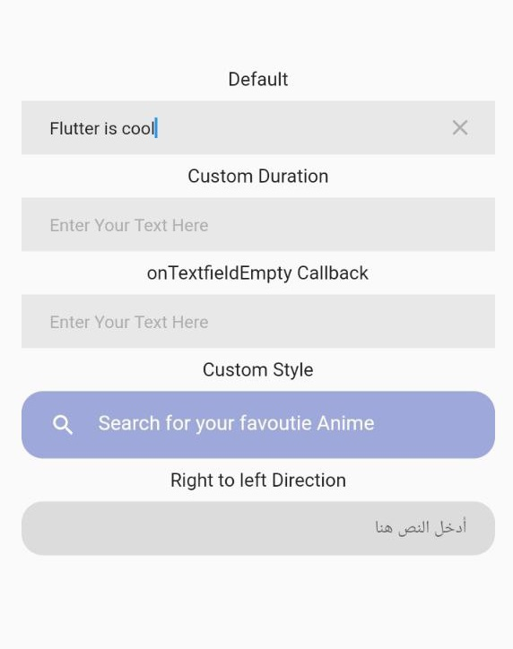

<!--
This README describes the package. If you publish this package to pub.dev,
this README's contents appear on the landing page for your package.

For information about how to write a good package README, see the guide for
[writing package pages](https://dart.dev/guides/libraries/writing-package-pages).

For general information about developing packages, see the Dart guide for
[creating packages](https://dart.dev/guides/libraries/create-library-packages)
and the Flutter guide for
[developing packages and plugins](https://flutter.dev/developing-packages).
-->

# debounce_textfield

A simple, lightweight, customizable textfield with debounce for preventing continuous execution of (onChange) callback.

## Installation

1. Add the latest version of package to your pubspec.yaml (and run`dart pub get`):

```yaml
dependencies:
  debounce_textfield: ^0.0.1
```

2. Import the package and use it in your Flutter App.

```dart
import 'package:debounce_textfield/debounce_textfield.dart';
```

## Image



## Example

You can simply just use the `DebounceTextfield` class and provide a callback to be executed after the delay.

```dart
DebounceTextfield(
          action: (enteredText) {
            print('Executed after 500 milliseconds from last change.');
            print(enteredText);
          },
        ),
```

## customization

### Custom Duration

```dart
DebounceTextfield(
          action: (enteredText) {
            print('Executed after 800 milliseconds from last change.');
            print(enteredText);
          },
          duration: const Duration(milliseconds: 800),
        ),
```

### onTextfieldEmpty Callback

```dart
 DebounceTextfield(
          action: (enteredText) {
            print('Executed after 500 milliseconds from last change.');
            print(enteredText);
          },
          onTextfieldEmpty: () {
            print('Textfield is empty now...');
          },
        ),
```

### Custom Style

```dart
 DebounceTextfield(
          action: (enteredText) {
            print('Executed after 500 milliseconds from last change.');
            print(enteredText);
          },
          height: 50,
          clearButtonIcon:
              const Icon(Icons.clear_rounded, color: Colors.white, size: 20),
          textFieldDecoration: BoxDecoration(
            borderRadius: BorderRadius.circular(16),
            color: Colors.indigo.shade200,
          ),
          inputDecoration: const InputDecoration(
            border: InputBorder.none,
            hintText: 'Search for your favoutie Anime',
            hintStyle: TextStyle(
              fontSize: 15,
              color: Colors.white,
            ),
            icon: Icon(
              Icons.search,
              color: Colors.white,
              size: 20,
            ),
          ),
          textFieldStyle: const TextStyle(
            fontSize: 15,
            color: Colors.white,
          ),
        ),
```

### Right-to-left Direction

```dart
 DebounceTextfield(
          action: (enteredText) {
            print('Executed after 500 milliseconds from last change.');
            print(enteredText);
          },
          direction: TextDirection.rtl,
          inputDecoration: const InputDecoration.collapsed(
            hintText: 'أدخل النص هنا',
            hintStyle: TextStyle(
              fontSize: 13,
              color: Colors.black54,
            ),
          ),
          textFieldDecoration: BoxDecoration(
            borderRadius: BorderRadius.circular(16),
            color: Colors.black12,
          ),
        ),
```
